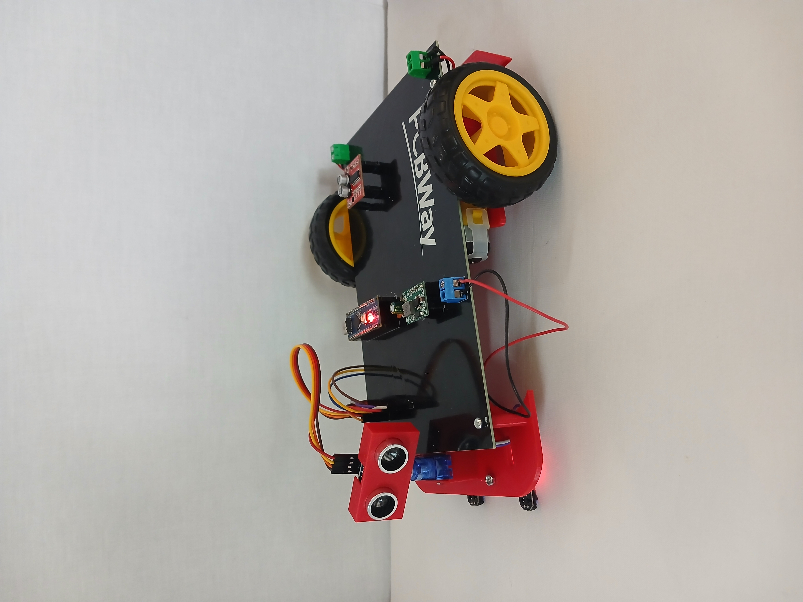
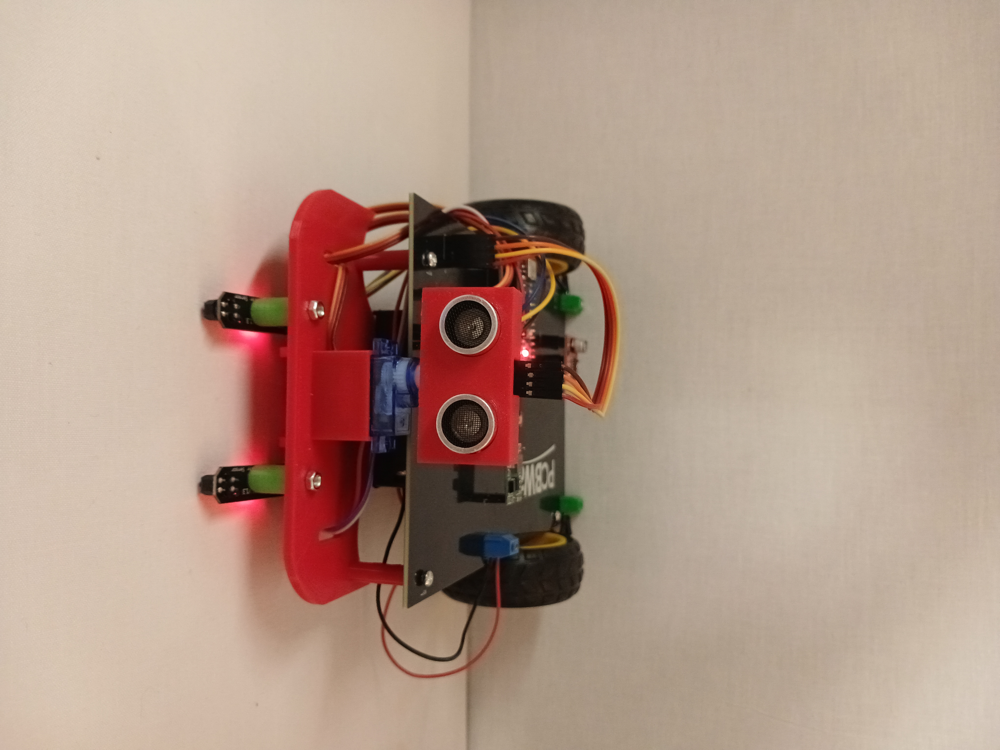
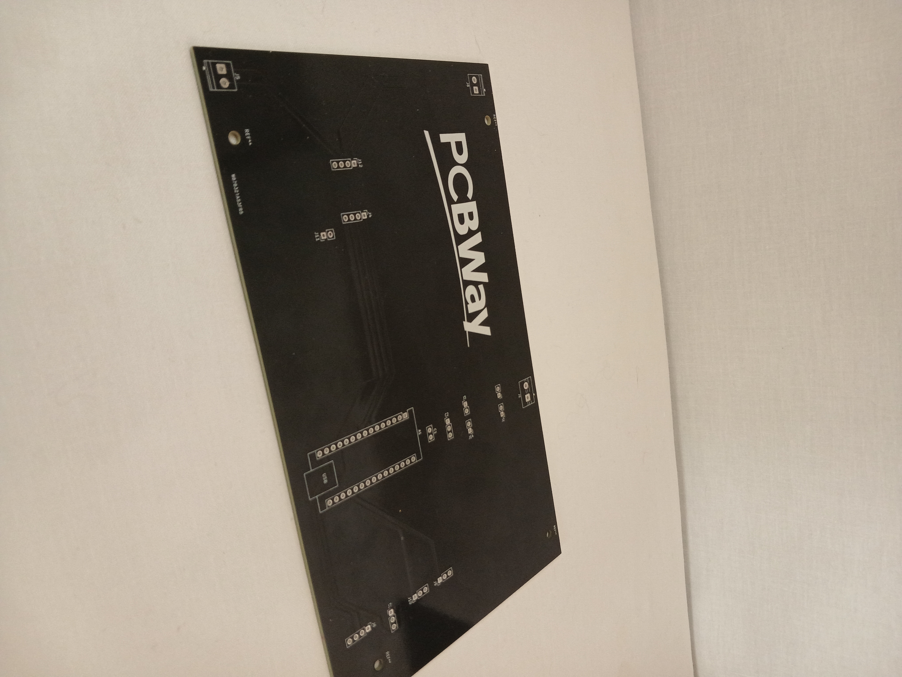

# 🤖 Robot Suiveur de Ligne / Line Follower Robot



---

## 🇫🇷 Description

Robot autonome suiveur de ligne construit autour d'une **Arduino Nano**, avec une structure imprimée en 3D et un PCB custom fabriqué par **PCBWay**. Le robot suit une ligne noire sur fond blanc, détecte les obstacles grâce à un capteur ultrason monté sur servomoteur, et s'arrête automatiquement en cas d'obstacle.

## 🇬🇧 Description

Autonomous line follower robot built around an **Arduino Nano**, with a 3D printed structure and a custom PCB manufactured by **PCBWay**. The robot follows a black line on a white background, detects obstacles using an ultrasonic sensor mounted on a servo motor, and automatically stops when an obstacle is detected.

---

## 📦 Composants / Components

| Composant | Quantité |
|---|---|
| Arduino Nano | 1 |
| Driver moteur L298N mini | 1 |
| Moteurs DC avec roues | 2 |
| Capteur ultrason HC-SR04 | 1 |
| Servomoteur (nuque) | 1 |
| Capteurs de sol TCRT5000 | 2 |
| PCB custom (PCBWay) | 1 |
| Structure imprimée en 3D | 1 |

---

## 🔌 Brochage / Wiring

| Composant | Broche Arduino |
|---|---|
| L298N IN1 (Moteur G) | D10 |
| L298N IN2 (Moteur G) | D6 |
| L298N IN3 (Moteur D) | D5 |
| L298N IN4 (Moteur D) | D3 |
| Servo moteur | D9 |
| HC-SR04 TRIG | D11 |
| HC-SR04 ECHO | D12 |
| TCRT5000 Gauche | A0 |
| TCRT5000 Droit | A1 |

---

## ⚙️ Logique / Logic

```
G=blanc + D=blanc  →  Avancer / Go straight
G=noir  + D=blanc  →  Tourner gauche / Turn left
G=blanc + D=noir   →  Tourner droite / Turn right
G=noir  + D=noir   →  Stop
Obstacle < 15cm    →  Stop total / Full stop
```

---

## 📸 Photos




---

## 💻 Code

Le code source est disponible dans ce dépôt :
- `suiveur_ligne_simple/suiveur_ligne_simple.ino` — Programme suiveur de ligne

---

## 🙏 Sponsored by PCBWay / Sponsorisé par PCBWay

<a href="https://www.pcbway.com">
  
</a>

### 🇬🇧 English Review

This project was made possible thanks to the generous sponsorship of [PCBWay](https://www.pcbway.com), one of the leading PCB manufacturers in the world.

After using PCBWay for this project, I can honestly say that I am very satisfied with their service. Here is my detailed review :

**🔧 PCB Quality**
The quality of the PCBs exceeded my expectations. The boards are clean, precise and perfectly manufactured. Every trace, hole and pad was exactly where it needed to be. No defects, no issues, just perfect boards ready to use straight out of the package.

**🚀 Delivery Speed**
One of the things that impressed me the most was the delivery speed. The PCBs arrived in just a few days, which is incredibly fast for manufactured boards. This allowed me to move forward with my project without any unnecessary delays.

**💻 Easy to Use Website**
The PCBWay website is very intuitive and easy to navigate. Uploading your Gerber files, choosing your specifications and placing an order takes only a few minutes. Even for beginners, the process is straightforward and well guided.

**🤝 Customer Service**
The customer service team at PCBWay is responsive, professional and genuinely helpful. Any question I had was answered quickly and clearly. It is rare to find such a level of support in this industry.

**Conclusion :** Whether you are a beginner working on your first project or an experienced engineer, PCBWay is a reliable and high quality choice for your PCB manufacturing needs. I highly recommend their service !

👉 [Order your PCBs on PCBWay](https://www.pcbway.com)

---

### 🇫🇷 Avis en français

Ce projet a été rendu possible grâce au généreux sponsoring de [PCBWay](https://www.pcbway.com), l'un des fabricants de PCB les plus reconnus au monde.

Après avoir utilisé PCBWay pour ce projet, je peux honnêtement dire que je suis très satisfait de leur service. Voici mon avis détaillé :

**🔧 Qualité des PCB**
La qualité des PCB a dépassé mes attentes. Les cartes sont propres, précises et parfaitement fabriquées. Chaque piste, trou et pad était exactement là où il devait être. Aucun défaut, aucun problème, juste des cartes parfaites prêtes à l'emploi dès la sortie du colis.

**🚀 Rapidité de livraison**
L'une des choses qui m'a le plus impressionné est la rapidité de livraison. Les PCB sont arrivés en seulement quelques jours, ce qui est incroyablement rapide pour des cartes fabriquées sur mesure. Cela m'a permis d'avancer dans mon projet sans délais inutiles.

**💻 Site web facile à utiliser**
Le site web de PCBWay est très intuitif et facile à naviguer. Télécharger vos fichiers Gerber, choisir vos spécifications et passer une commande ne prend que quelques minutes. Même pour les débutants, le processus est simple et bien guidé.

**🤝 Service client**
L'équipe du service client de PCBWay est réactive, professionnelle et véritablement serviable. Chaque question que j'avais a été répondue rapidement et clairement. Il est rare de trouver un tel niveau de support dans ce secteur.

**Conclusion :** Que vous soyez débutant sur votre premier projet ou ingénieur expérimenté, PCBWay est un choix fiable et de haute qualité pour vos besoins de fabrication de PCB. Je recommande vivement leur service !

👉 [Commandez vos PCB sur PCBWay](https://www.pcbway.com)

---

## 📄 Licence / License

MIT License — libre d'utilisation / free to use
